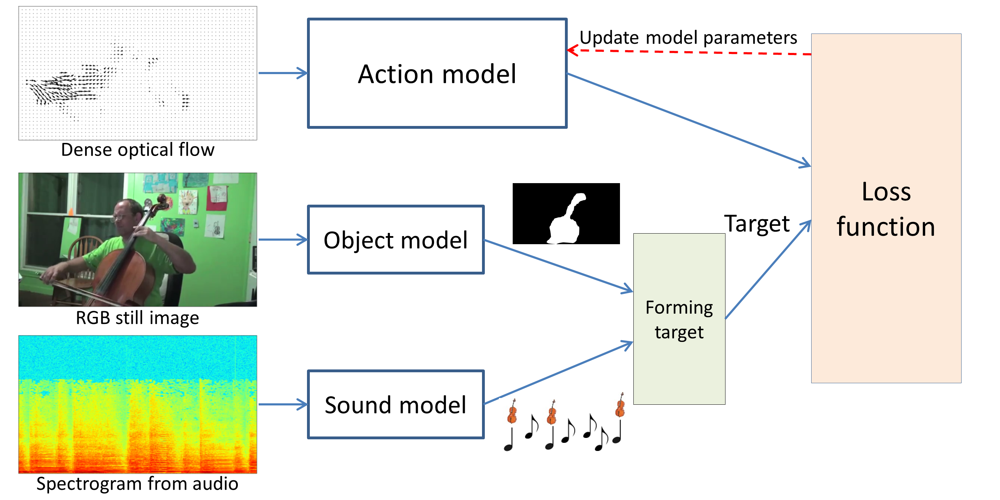

InstrumentPlayingDetection
==========================

## Introduction
In this work, we want to detect instrument-playing actions temporally and spatially from videos, that is, we want to know when and where the playing actions occur.

The difficulty is in the lack of training data with detailed locations of actions. We deal with this problem by utilizing two auxiliary models: a sound model and an object model. The sound model predicts the temporal locations of instrument sounds and provides temporal supervision. The object model predicts the spatial locations of the instrument objects and provides spaital supervision.

### Proposed framework

    

## Installation

`python setup.py install`

## Test data (Sound)
http://mac.citi.sinica.edu.tw/~liu/data/InstrumentPlayingDetection/MedleyDB.zip

This file includes the features and annotations converted from the original timestamps for the evaluation in this work. The original files are from http://medleydb.weebly.com/

## Pretrained models
load into a python dict with `torch.load`

### Sound model
FCN trained with AudioSet

Download:
http://mac.citi.sinica.edu.tw/~liu/data/InstrumentPlayingDetection/models/sound/params.AudioSet.torch

### Object model
FCN trained with YouTube8M, pretrained with VGG_CNN_M_2048 model

Download:
http://mac.citi.sinica.edu.tw/~liu/data/InstrumentPlayingDetection/models/object/params.torch

### Action model
FCN trained with YouTube8M

Download:

Video tag as target (VT)
http://mac.citi.sinica.edu.tw/~liu/data/InstrumentPlayingDetection/models/action/params.VT.torch

Sound*Object as target:
http://mac.citi.sinica.edu.tw/~liu/data/InstrumentPlayingDetection/models/action/params.SOT0503.torch

## Usage

### Use the sound model

### Use the object model

### Use the action model

 

