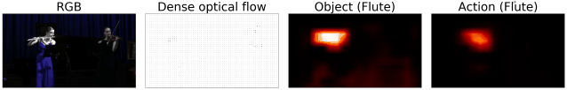
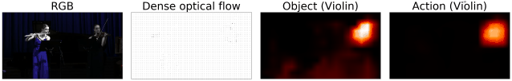
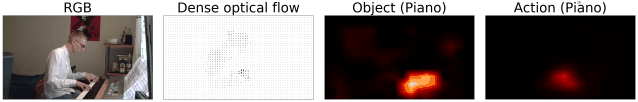
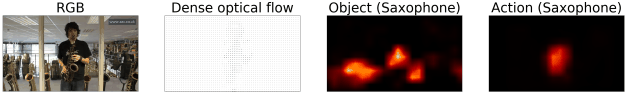
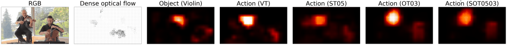
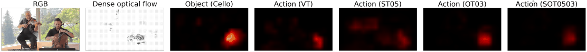
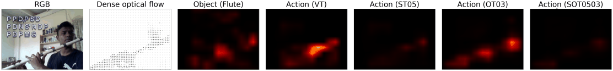

InstrumentPlayingDetection
==========================

This repository contains the code and data used in the following paper:

**_Weakly-supervised Visual Instrument-playing Action Detection in Videos_** authored by **Jen-Yu Liu, Yi-Hsuan Yang, and Shyh-Kang Jeng**

It was submitted to a journal and is currently under review. The preprint version can be found here: [Preprint](https://github.com/ciaua/InstrumentPlayingDetection/raw/master/files/preprint.pdf)

## Introduction
In this work, we want to detect instrument-playing actions temporally and spatially from videos, that is, we want to know when and where the playing actions occur.

The difficulty is in the lack of training data with detailed locations of actions. We deal with this problem by utilizing two auxiliary models: a sound model and an object model. The sound model predicts the temporal locations of instrument sounds and provides temporal supervision. The object model predicts the spatial locations of the instrument objects and provides spaital supervision.

### Proposed framework

    

## Examples of our result

| Instrument |       |
| ---------- | ----- |
| Flute      |  |
| Violin     |  |
| Piano      |  |
| Saxophone  | |

## Comparing models trained with different types of targets

| Instrument |       |
| ---------- | ----- |
| Violin     |  |
| Cello      |  |
| Flute      | |

## Some sample videos of our result
http://mac.citi.sinica.edu.tw/~liu/videos_instrument_playing_detection_web.zip

## Installation

`python setup.py install`

## Test data

### Action
We manaully annotated the playing actions from clips of 135 videos (15 for each instrument). Totally 5400 frames are annotated.

`data/action_annotations/`

### Sound
http://mac.citi.sinica.edu.tw/~liu/data/InstrumentPlayingDetection/MedleyDB.zip

This file includes the features and annotations converted from the original timestamps for the evaluation in this work. The original files are from http://medleydb.weebly.com/

## Pretrained models
load into a python dict with `torch.load`

### Sound model
FCN trained with AudioSet

Download:
http://mac.citi.sinica.edu.tw/~liu/data/InstrumentPlayingDetection/models/sound/params.AudioSet.torch

### Object model
FCN trained with YouTube8M, pretrained with VGG_CNN_M_2048 model

Download:
http://mac.citi.sinica.edu.tw/~liu/data/InstrumentPlayingDetection/models/object/params.torch

### Action model
FCN trained with YouTube8M

Download:

Video tag as target (VT):
http://mac.citi.sinica.edu.tw/~liu/data/InstrumentPlayingDetection/models/action/params.VT.torch

Sound*Object as target (SOT0503):
http://mac.citi.sinica.edu.tw/~liu/data/InstrumentPlayingDetection/models/action/params.SOT0503.torch

## Scripts

### Evaluate the sound model
`scripts/AudioSet/test.FCN.merged_tags.multilogmelspec.py`

### Evaluate the action model
`scripts/YouTube8M/compute_predictions.fragment.dense_optical_flow.no_resize.py`
`scripts/YouTube8M/extract_image.fragment.no_padding.py`
`scripts/YouTube8M/test.action.temporal.py`
`scripts/YouTube8M/test.action.spatial.py`
